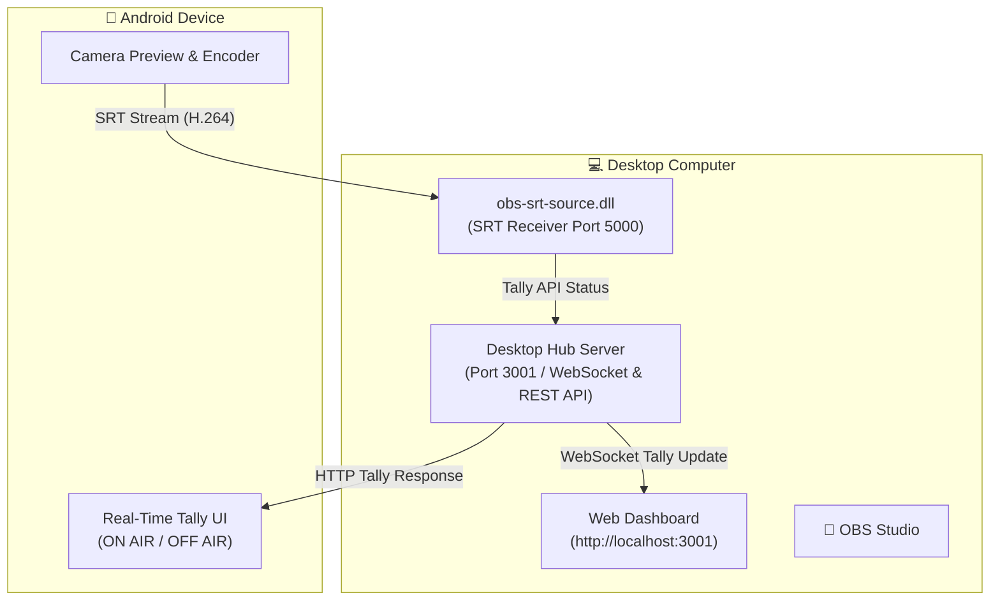

# 🎥 SRT Camera Hub 🚀

[](https://github.com/ajwaad/srt-camera-hub/releases/tag/v1.0.0)
[](LICENSE)
[](#)

Turn your Android phone into an **ultra-low-latency, professional wireless camera and tally system** for OBS Studio!

The **SRT Camera Hub** ecosystem provides low-latency video streaming over Secure Reliable Transport (SRT), paired with automatic real-time **Tally Light** indicators on both your smartphone screen and desktop dashboard.

---

## 🌟 Key Features

- ⚡ **Ultra-Low Latency SRT Streaming**: High-quality H.264 video pipeline over local Wi-Fi / LAN with sub-frame latency.
- 🔴 **Bi-Directional Tally System**: Automatically detects when a camera feed is **LIVE (ON AIR)** in OBS Studio and lights up the smartphone screen red + updates the Web Dashboard.
- 💻 **Standalone Desktop Hub**: Zero-dependency single executable (`srt-camera-hub.exe`) with built-in web management dashboard (`http://localhost:3001`).
- 🎥 **Native OBS Studio Integration**: One-click installer (`install-srt-plugin.exe`) adds a high-performance C++ SRT Source filter directly into OBS Studio.
- 📱 **Android Mobile App**: Simple, robust Android app (`srt-camera-app.apk`) with live preview, camera selection, and instant connection to the Hub.

---

## 📦 Quick Downloads (v1.0.0)

For end users wanting to start streaming immediately, download the pre-compiled binaries from the **[v1.0.0 Release Page](https://github.com/ajwaad/srt-camera-hub/releases/tag/v1.0.0)**:

| Component | Target Platform | Binary Download |
|---|---|---|
| **Android App** | Android 7.0+ | [📲 srt-camera-app.apk](https://github.com/ajwaad/srt-camera-hub/releases/download/v1.0.0/srt-camera-app.apk) |
| **Desktop Hub** | Windows (x64) | [💻 srt-camera-hub.exe](https://github.com/ajwaad/srt-camera-hub/releases/download/v1.0.0/srt-camera-hub.exe) |
| **OBS Plugin Installer** | Windows (x64) | [🎥 install-srt-plugin.exe](https://github.com/ajwaad/srt-camera-hub/releases/download/v1.0.0/install-srt-plugin.exe) |

---

## 🏗 System Architecture



---

## 🚀 Quick Start Guide

### 1. Launch the Desktop Hub
Run `srt-camera-hub.exe`. Open your web browser to **`http://localhost:3001`** to monitor active camera connections and tally states.

### 2. Install the OBS Studio Plugin
Run `install-srt-plugin.exe` (or copy `obs-srt-source.dll` to your OBS plugin folder). Open OBS Studio, click **Add Source**, and select **SRT Source**.

### 3. Connect your Android Phone
Install `srt-camera-app.apk` on your mobile phone. Enter the IP address of your Desktop Hub computer, tap **Start Stream**, and your camera feed will appear live in OBS Studio with automated Tally indicator light!

---

## 🛠 Developer Build Guide

If you wish to compile the codebase from source:

### 1. Android Client (`/android-cam`)
```bash
cd android-cam
./gradlew assembleDebug
```
Output APK: `android-cam/app/build/outputs/apk/debug/app-debug.apk`

### 2. Desktop Hub Runtime (`/desktop-hub`)
```bash
cd desktop-hub
npm install
npm start
```
To bundle into a standalone executable:
```bash
node build-scripts/build-runtime.js
```

### 3. C++ OBS Plugin (`/obs-plugin`)
Requires CMake 3.28+ and Visual Studio 2022 (x64):
```bash
cmake -B build_x64 -S obs-plugin
cmake --build build_x64 --config RelWithDebInfo
```
Run `node build-scripts/build-plugin-installer.js` to construct the single-file installer binary.

---

## 📜 License
Distributed under the **GNU General Public License v2.0**. See `LICENSE` for details.

